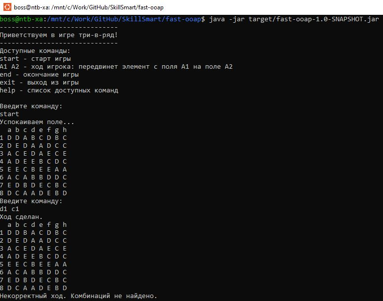
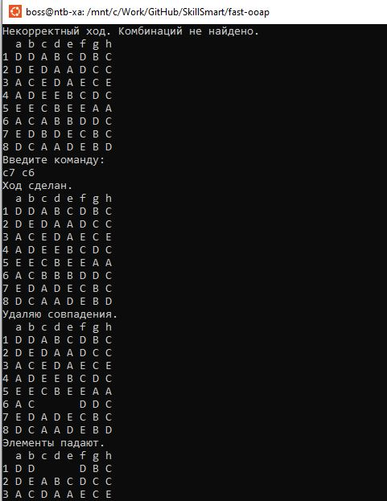
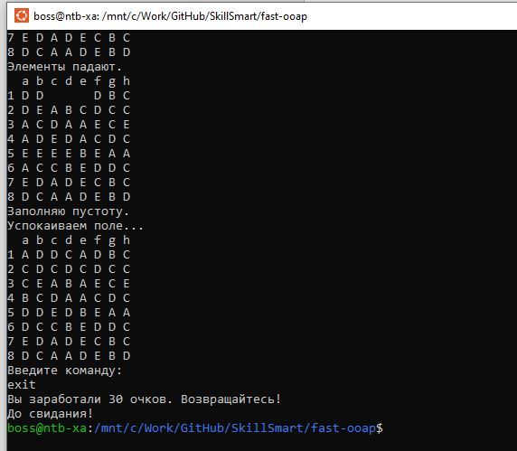

Сборка игры:
- mvn clean package (запустить в каталоге с pom.xml)

запуск (выполнить команду в том же каталоге):
- java -jar target/fast-ooap-1.0-SNAPSHOT.jar

Технические требования:
- Apache Maven 3.4.1 или выше
- Java 21

Доступные команды:
-
- start - старт игры
- A1 A2 - ход игрока: передвинет элемент с поля A1 на поле A2
- end - окончание игры
- exit - выход из игры
- help - список доступных команд

Скриншоты игрового процесса
-

Конечно жутко стыдно показывать такой ужасный и грязный код, но, на что наработал. В общих чертах основное конечно работает, кроме проверки на наличие доступных ходов и бонусов - это я не реализовал.
Но дело конечно совсем не в этом. Ожидание и результат, как говориться, "две большие разницы".  Распланированные на проектировании АСД при сборке "рассыпались". 
Как результат каши в голове - каша в итоговом коде. В принципе я чего-то похожего и ожидал, хотя старался глубоко вникать при решении заданий.
Но тут скорее мой общий уровень. 

Но главное, что я увидел как для хорошо спроектированных АСД практически сам "генерируется" код - я даже почти не думал, он как-то сам лился :)
Очень хорошо видно где проектирование было приемлемым - тут скорость и простота "набивания" кода просто замечательная. Ну а где все плохо - сразу ступор в реализации и допроектирование на ходу. По итогу и Observer не реализовал да и с Command напортачил.

Но теперь понятен следующий шаг - уже с пониманием того, что и куда ведет в итоге, надо просто перепроектировать ТЗ. Когда прошел весь путь, хоть и неудачно, гораздо яснее становятся ошибки, допущенные по ходу.